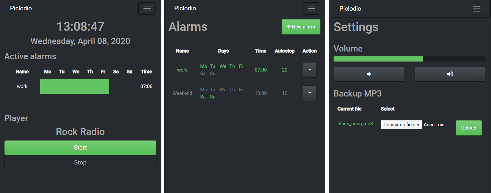

# Piclodio3
[](https://gitter.im/piclodio/Lobby)

Piclodio is a web radio player and a also an alarm clock that can be installed on Raspberry Pi.
You can add url stream to complete the collection. Scheduling alarm clock is easy and can be periodic.
A local backup MP3 file is used in case of losing internet connection or if the web radio is not anymore available to be sure you'll be awaken.



## Installation

### Via Docker

The project can be deployed via the provided docker compose file. Check [this doc](doc/install_docker_rpi.md) to install Docker and docker-compose on your RPI.
```
git clone https://github.com/Sispheor/piclodio3.git
cd piclodio3
docker-compose up
```

Then access the UI via you web broswer with the IP of your host (type `ip a` to get it). E.g: "http://192.168.0.22/"

### Development env

The project is split in two parts:
- [Backend based on Django Rest Framework](back/README.md)
- [Frontend based on Angular 9](front/README.md)

Installation procedures have been tested on a Raspberry Pi and on Ubuntu 18.04/20.04 but the project should works on any Linux system that can handle Django and Angular.

## Web Radio URLs

There is a lot of web radio online. In most of case, websites provide a `pls` or `m3u` file that contain the URL you need to give to Piclodio.
You can also get the URL from the console of your web browser. Look for the URL that consume the most brandwith in the network console.

Take a look to [internet-radio.com](https://www.internet-radio.com/) for a large selection of web radio sorted by genre.

## API doc

You can accees to API doc on the "/redoc" URL.

## Timezone

By default the time is showed in UTC. If you want to change the timezone, update the file `piclodio3/back/piclodio3/settings.py`
E.g:
```
TIME_ZONE = 'Europe/Paris'
```

## Raspberry output jack

To set the audio out to jack instead of HDMI:
```
amixer cset numid=3 1
```

- 1: Jack
- 2: HDMI
- 3: auto

## Contribute

If you need help you can come on the [Gitter chat room](https://gitter.im/piclodio/Lobby).
Fell free to open an issue to ask a new feature or raise a bug.

## License

Copyright (c) 2016. All rights reserved.

Piclodio is covered by the MIT license, a permissive free software license that lets you do anything you want with the source code, as long as you provide back attribution and "don't hold you liable". For the full license text see the [LICENSE.md](LICENSE.md) file.
